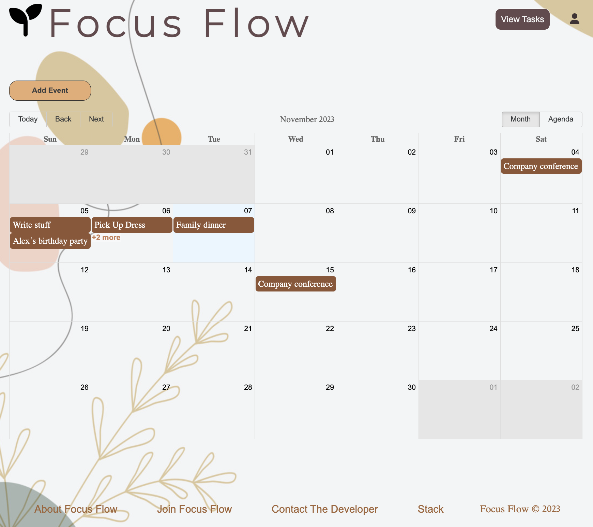
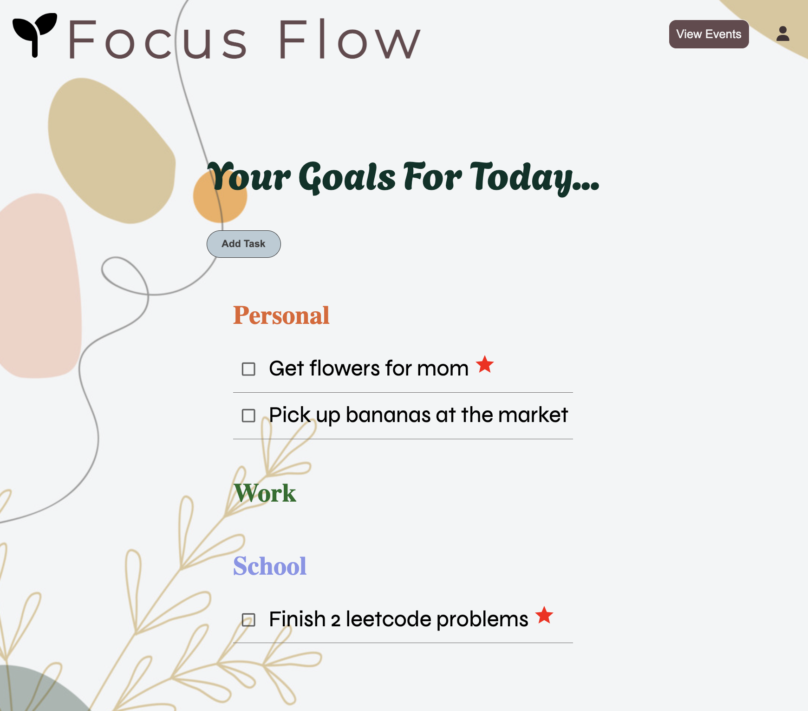
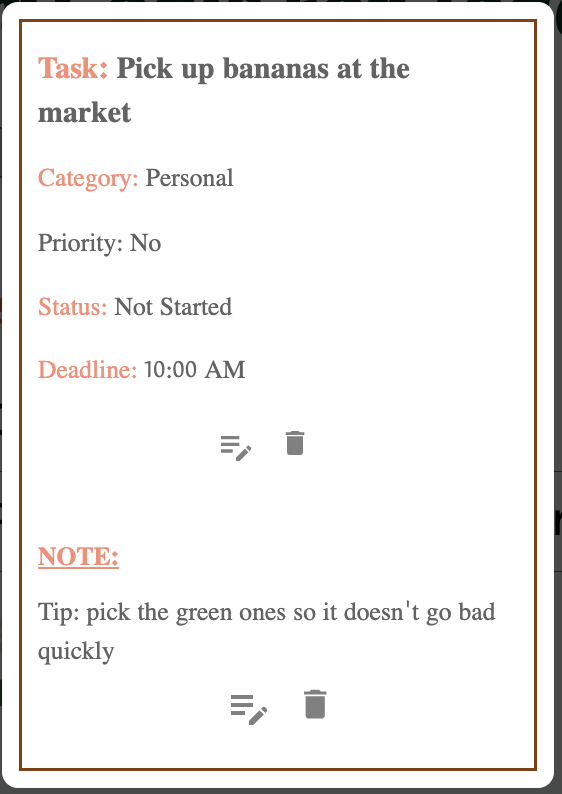
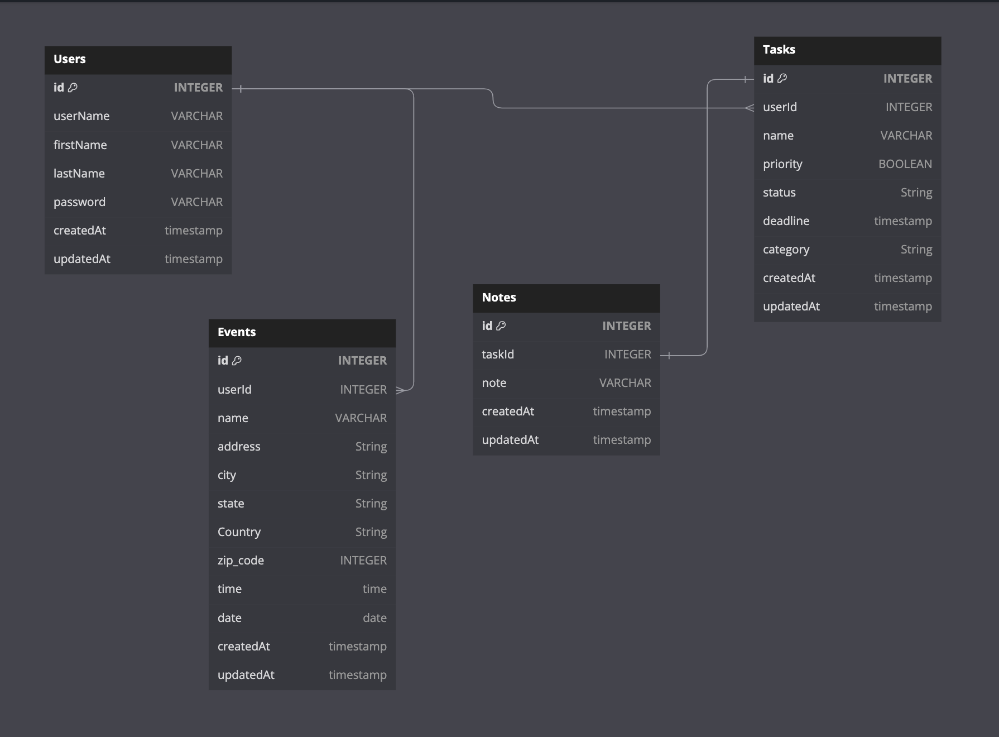

## Summary:
Focus Flow is a web application that allows users to effortlessly keep track of their daily responsibilities and mark down future events on the calendar.
Users are able to see all their tasks for the day, as well as create, edit, and complete tasks. Along with each task, users have the option to add any additional
notes that they have for that task. In addition, users can also use the calendar to mark down important events so they don't forget! The goal of Focus Flow is to help users stay focused and organized because we all know that life can get very chaotic!

https://focus-flow-urhu.onrender.com

## Technologies Used
Backend: Flask, SQLAlchemy

Frontend: React, Redux

Database: PostgreSQL

Hosting: Render

## Landing Page

## Event Page

## Task Page

## Note

## Next Features
1. Making the application a multi-user application where users are able to share tasks and events with one another
2. Bring in Google Maps API to direct users to their event's destination

## Wiki Pages

### Home (About):
https://github.com/huynhlam56/Focus-Flow-Project

### Database Schema:

### Wireframe:
https://github.com/huynhlam56/Focus-Flow-Project/wiki/WireFrame

### API Backend Routes:
https://github.com/huynhlam56/Focus-Flow-Project/wiki/Backend-Routes

### User Stories:
https://github.com/huynhlam56/Focus-Flow-Project/wiki/Users-Stories

## Setup:
# Build command:

npm install --prefix react-app && npm run build --prefix react-app && pip install -r requirements.txt && pip install psycopg2 && pip install email_validator && flask db upgrade && flask seed all

# Start command:
gunicorn app:app
